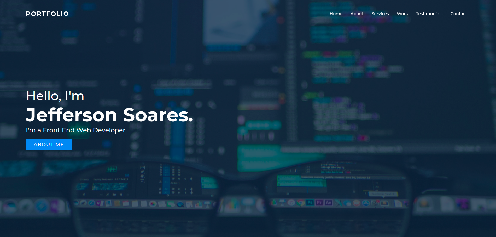
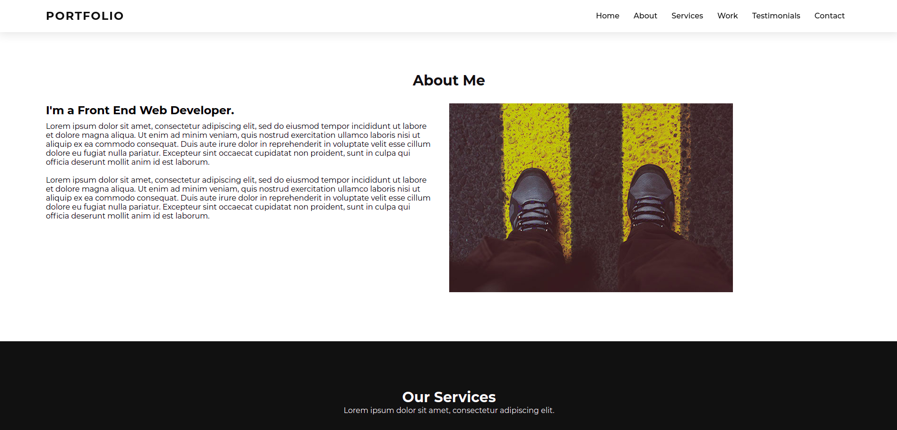
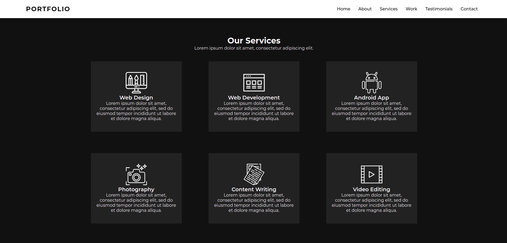
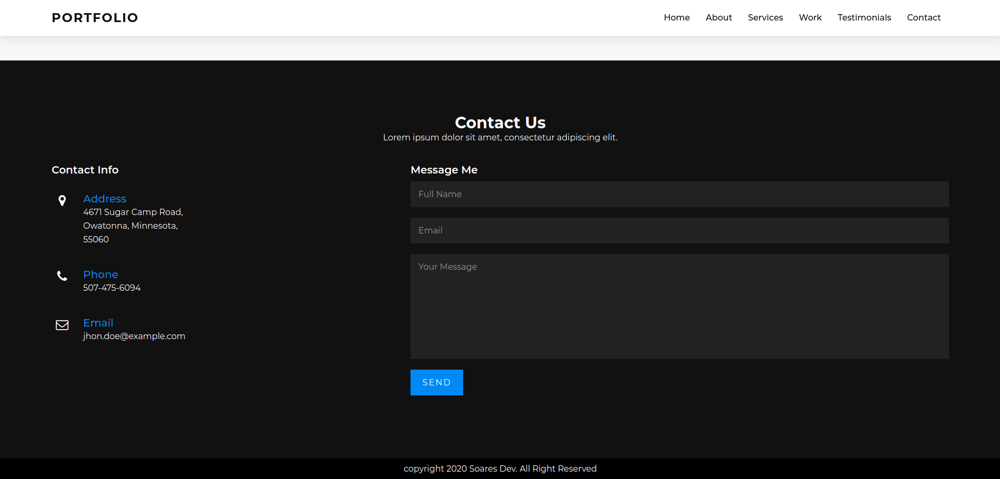

<h2 align="center">
  Food Responsive Website
</h2>

<p align="center">
  

  

  
</p>

<br>

### :writing_hand: About this project
This is a website with the portfolio theme of a front end web developer, on this website I executed CSS3 practices to style and used some basic javascript resources in the website menu, a responsive website for mobile and desktop, check the source code and enjoy to implement in your personal projects.


### :cyclone: How to run this project
```bash
# Clone this repository
$ git clone https://github.com/jefferson1104/portfolio-responsive-website.git

# Access the project folder
$ cd portfolio-website

# Open 'index.html' with your browseror

```
### 🎨 Screenshot
<p align="center">
  
  
  
  
</p>